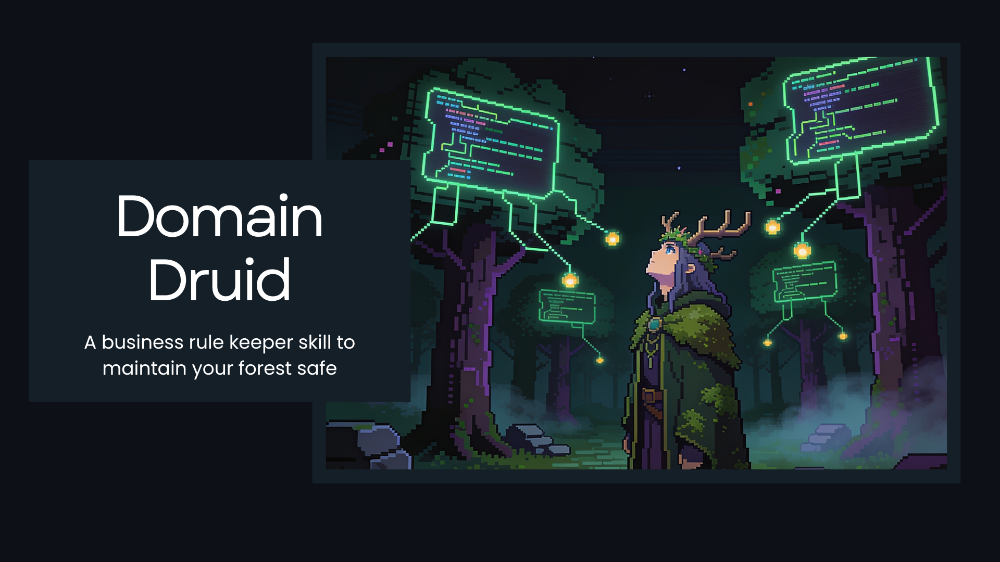

<p align="center">
  
</p>

# Domain Druid

Continuously ingests, maintains, and validates living business logic documentation. Auto-detects rules from code changes, specs, tests, and conversations. Proposes updates, asks for validation, self-organizes via auto-splitting, and audits new code against existing rules via the Rule Druid compliance checker.

## Quickstart

```bash
npx skills@latest add abertanha/domain-druid-skill
```

Then run `/build` in your agent. It scaffolds `.business-logic/<repo>/` in your project and you're ready.

### Manual install

```bash
git clone https://github.com/abertanha/domain-druid-skill.git
# Symlink into your agent's skills directory
ln -s $(pwd)/domain-druid-skill/skills/domain-druid ~/.config/opencode/skills/domain-druid
```

---

## Why This Skill Exists

I built Domain Druid to fix four common failure modes in AI-assisted development.

### #1: Business Rules Are Scattered And Invisible

> "The biggest bottleneck to AI coding is the knowledge the model doesn't have."

**The Problem**. Business rules live in Slack threads, PR comments, Jira tickets, test files, and peoples' heads. When an agent starts a session, it has no systematic way to discover: "What are the invariants here? What are the limits? What decisions have been made?"

So it guesses. Sometimes correctly, often not.

**The Fix** is a living document (`.business-logic/<repo>/LOGIC.md`) that auto-detects rules from multiple signal sources — git diffs, test assertions, spec files, config constants, and conversation. Every signal goes through an interactive confirmation loop (y/n/edit) before anything is written.

### #2: Agents Hallucinate Business Logic

> "Never invent a rule without code."

**The Problem**. When you tell an agent "remember, refunds must be processed within 30 days," it may treat that as a fact — even if no code enforces it. Next session, it might cite that rule as if it were implemented, creating a false audit trail.

**The Fix** is two **hallucination guardrails**:
1. Every rule marked as **active** must have at least one verified `Code:` entry pointing to a real file:line:function in the codebase.
2. Every `Code:` entry is checked against the actual filesystem before being saved. If the file doesn't exist, the write is blocked.

Conversation-only rules are stored as **proposed** — developer intent, tracked but never presented as implemented.

### #3: Rules Drift From Code Over Time

> "The documentation is already wrong."

**The Problem**. You documented a rule six months ago. Since then, the team changed the threshold, removed the validation, or added a new exception. Nobody updated the doc. Now the doc and the code disagree — and neither the humans nor the agent knows which is correct.

**The Fix** is `/validate-bl`. It cross-references every active rule against the actual codebase:

| Check | What it detects |
|-------|----------------|
| Forward traceability | Every rule has at least one verified Code: entry |
| Backward traceability | Every `// BL-RULE-NNN` annotation links to an existing rule |
| Stale file | Code: entry points to a file that no longer exists |
| Stale line | Code: entry points to a line where the construct no longer matches |
| Cross-layer drift | Same fingerprint, different values across layers (backend vs frontend) |
| Active without code | Rule is marked active but has no verifiable Code: entries |

### #4: PRs Break Undocumented Rules

> "That change looks fine. But it violates a rule nobody wrote down."

**The Problem**. A developer refactors a validation function. The tests pass. The code compiles. But an implicit business rule — "manager approval is required for refunds over $500" — was being enforced by a conditional that the refactor removed. Nobody catches it until prod.

**The Fix** is the **Rule Druid** (`/check-bl`) — a context-aware compliance auditor. Unlike naive keyword matching, the Druid understands:
- **Middleware stacks** — auth rules enforced at router level
- **Delegation boundaries** — opaque calls to validation functions
- **Compound rules** — rules with multiple invariants (partial enforcement detection)
- **Cross-domain code** — code that touches multiple business domains

For full PR reviews, `/review-pr` runs the entire arsenal against a branch diff: compliance check, new rule detection, cross-reference (contradiction/drift/gap), and suggestions.

---

## Reference

### Commands

| Command | Action |
|---------|--------|
| `/sync-bl` | Full scan: git log since last sync + all specs + all tests → diff against LOGIC.md |
| `/validate-bl` | Cross-reference LOGIC.md against codebase, surface contradictions, drift, and traceability gaps |
| `/review-bl` | Present PENDING.md for batch review |
| `/scan-bl <path>` | Scan file, module, or PR diff for potential business rules — interactive |
| `/check-bl <path>` | Rule Druid — audit new/modified code against active business rules |
| `/review-pr` | Peer review of a pull request branch — 4-pass review (compliance, detection, cross-ref, suggestions) |
| `/reset-bl-skip` | Clear the skip cache (re-suggest previously rejected patterns) |
| `/history-bl` | Load CHANGELOG.md (never auto-loaded without this) |
| `/archive-bl` | Move deprecated rules to archive, regenerate INDEX.md + RELATIONS.md |

### Architecture

```
.workspace-root/
├── repo1/
└── .business-logic/
    ├── repo1/
    │   ├── LOGIC.md           # Active business rules
    │   ├── FINGERPRINTS.md    # Dedup index (always loaded)
    │   ├── PENDING.md         # Proposed entries awaiting review
    │   ├── SEGMENTS.md        # Tag-based segment lookup (after split)
    │   ├── RELATIONS.md       # Rule-to-rule relationships
    │   ├── CHANGELOG.md       # Change history
    │   ├── skip-cache.json    # Rejected pattern cache
    │   ├── split/             # Segment files (auto-split at 1000t)
    │   ├── reviews/           # PR review reports
    │   └── archive/           # Deprecated rules
    └── repo2/
        └── ...
```

### Entry lifecycle

```
proposed  (conversation/intent, no code)
    │ code detected
    ▼
pending → active → superseded → archived
               ↓
          deprecated  ──────────┘
```

### Files

```
skills/domain-druid/
├── SKILL.md                          # Entry point, workflow, commands
└── references/
    ├── auto-detect.md                # Detection strategies (git, conversation, spec, scan)
    ├── analyze.md                    # Extraction pipeline, cross-reference, interactive confirm
    ├── format.md                     # Entry schema, field types, fingerprint rules
    ├── validate.md                   # Validation flows, drift detection, traceability checks
    ├── split.md                      # Auto-split at 1000t, segment structure, INDEX.md
    ├── context.md                    # Token budget table, deterministic loading algorithm
    ├── rule-druid.md                 # Compliance auditor algorithm, edge case handling
    └── review-pr.md                  # PR peer review workflow (4-pass)
```

---

## License

MIT
